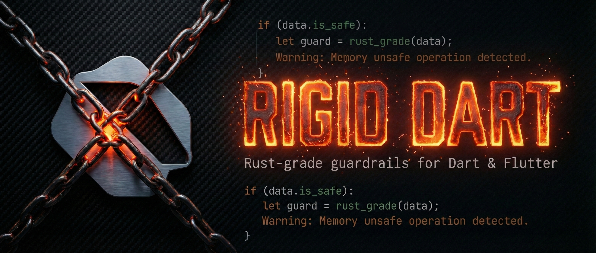

<p align="center">
  
</p>

<h1 align="center">🦀 Rigid Dart</h1>

<p align="center">
  <strong>Rust-grade guardrails for Dart & Flutter.</strong><br>
  A <code>custom_lint</code> plugin that turns analyzer warnings into walls.
</p>

<p align="center">
  
  
  
  
</p>

---

## The Problem

Dart's compiler is lenient. It lets you ship layout crashes, untyped state,
hardcoded colors, deprecated APIs, and `dynamic` casts that Rust would
catch at compile time. AI agents make this worse — they generate code that
*works* but violates every architecture principle you've established.

## The Solution

Rigid Dart is a `custom_lint` plugin that enforces **19 rules** as hard
analyzer errors. Every rule uses **TypeChecker-based type resolution** —
it catches aliases, subclasses, and reexports, not just string names.
It also ships **3 quick fixes**, a **strict `analysis_options.yaml`** base,
and an optional **PATH wrapper** that blocks `flutter run` until your code
is clean.

```
🦀 Rigid Dart gate -- analyzing before compile...

  error - lib/home_page.dart:42:9
    Colors.blue is banned. Use Theme.of(context).colorScheme.* instead.
    rigid_no_hardcoded_colors

════════════════════════════════════════════════════════
  ❌ RIGID DART: Analysis failed. Fix violations above.
════════════════════════════════════════════════════════
```

The agent sees a build failure. It fixes the code. It retries. That's the loop.

---

## Rules

### Phase 1: Layout Safety
*Catches runtime crashes before they happen.*

| Rule | Sev | What it catches |
|------|-----|-----------------|
| `rigid_no_expanded_outside_flex` | 🔴 | `Expanded`/`Flexible` outside `Row`/`Column`/`Flex` |
| `rigid_no_unbounded_column` | 🟡 | Nested `Column`/`ListView` in scrollables without constraints |
| `rigid_constrained_text_field` | 🔴 | `TextField` in `Row` without width constraint |

### Phase 2: State Discipline
*Enforces Riverpod. Prevents memory leaks and async crashes.*

| Rule | Sev | What it catches |
|------|-----|-----------------|
| `rigid_no_set_state` | 🔴 | Any `setState()` call (type-resolved: checks receiver is `State<T>`) |
| `rigid_no_change_notifier` | 🔴 | `ChangeNotifier` subclass/mixin (catches via `isAssignableFrom`) |
| `rigid_exhaustive_async` | 🔴 | Direct `.value` on `AsyncValue` without `.when()` |
| `rigid_no_build_context_across_async` | 🔴 | `BuildContext` used after `await` without `mounted` check |
| `rigid_dispose_required` | 🔴 | Disposable controllers (AnimationController, FocusNode, etc.) not disposed |

### Phase 3: Architecture
*Enforces design system usage. Bans magic values.*

| Rule | Sev | What it catches |
|------|-----|-----------------|
| `rigid_no_hardcoded_colors` | 🔴 | `Color(0xFF...)` or `Colors.*` outside theme definitions |
| `rigid_no_hardcoded_text_style` | 🟡 | Raw `TextStyle(fontSize: N)` outside theme definitions |
| `rigid_no_magic_numbers` | 🟡 | Literal numbers in layout params (padding, margin, etc.) |

### Phase 4: Freshness
*Bans deprecated APIs. Enforces modern Dart.*

| Rule | Sev | What it catches |
|------|-----|-----------------|
| `rigid_no_will_pop_scope` | 🔴 | Deprecated `WillPopScope` → **quick fix: PopScope** |
| `rigid_no_with_opacity` | 🔴 | Deprecated `.withOpacity()` → **quick fix: .withValues(alpha:)** |
| `rigid_no_dynamic` | 🔴 | Explicit `dynamic` type annotations → **quick fix: Object?** |
| `rigid_no_print` | 🟡 | `print()` calls in non-test code |

---

## Quick Start

### 1. Install

```yaml
# pubspec.yaml
dev_dependencies:
  custom_lint: ^0.8.1
  rigid_dart:
    git:
      url: https://github.com/adriancmurray/rigid_dart.git
```

```bash
flutter pub get
```

### 2. Configure

```yaml
# analysis_options.yaml
include: package:rigid_dart/analysis_options.yaml

analyzer:
  plugins:
    - custom_lint
```

### 3. Analyze

```bash
# Standard analysis (strict options from rigid_dart)
dart analyze --fatal-infos

# Custom rules (the 15 rigid_* rules)
dart run custom_lint
```

### Quick Fixes

Three rules offer IDE quick fixes (lightbulb menu):

| Rule | Quick fix |
|------|-----------|
| `rigid_no_with_opacity` | Replace `.withOpacity(x)` → `.withValues(alpha: x)` |
| `rigid_no_will_pop_scope` | Replace `WillPopScope` → `PopScope` |
| `rigid_no_dynamic` | Replace `dynamic` → `Object?` |

---

## Enforcement Tiers

| Tier | Name | Blocks | Agent can bypass? |
|------|------|--------|-------------------|
| 1 | **Advisor** | Nothing — IDE warnings only | ✅ Yes |
| 2 | **Gatekeeper** | `git commit` | 🔶 Can still run locally |
| 3 | **Compiler** | `flutter run/build/test` | ❌ No |

See [AGENT.md](AGENT.md) for full setup instructions for each tier.

---

## Suppressing Rules

Per-line only. Global suppression is not supported by design.

```dart
// ignore: rigid_no_hardcoded_colors
final debugColor = Colors.red; // Emergency escape hatch
```

For multi-line blocks:

```dart
// ignore_for_file: rigid_no_magic_numbers
// Only in spacing_tokens.dart where constants are DEFINED
const kCardPadding = 16.0;
const kSectionSpacing = 24.0;
```

---

## Modifying Rules

### Adding a new rule

1. Create a file in `lib/rules/<phase>/` (e.g., `lib/rules/state/no_global_keys.dart`)
2. Extend `DartLintRule` from `custom_lint_builder`
3. Define a `LintCode` with a `rigid_` prefix and appropriate severity
4. Implement the `run` method using `context.registry.add*` callbacks
5. Register the rule in `lib/rigid_dart.dart`

Example skeleton:

```dart
import 'package:analyzer/error/error.dart' show DiagnosticSeverity;
import 'package:analyzer/error/listener.dart' show DiagnosticReporter;
import 'package:custom_lint_builder/custom_lint_builder.dart';

class NoGlobalKeys extends DartLintRule {
  const NoGlobalKeys() : super(code: _code);

  static const _code = LintCode(
    name: 'rigid_no_global_keys',
    problemMessage: 'GlobalKey is banned. Use ValueKey or UniqueKey.',
    errorSeverity: DiagnosticSeverity.ERROR,
  );

  @override
  void run(
    CustomLintResolver resolver,
    DiagnosticReporter reporter,
    CustomLintContext context,
  ) {
    context.registry.addInstanceCreationExpression((node) {
      // Your detection logic here
      reporter.atNode(node, code);
    });
  }
}
```

Then add to `lib/rigid_dart.dart`:

```dart
import 'package:rigid_dart/rules/state/no_global_keys.dart';
// ...
const NoGlobalKeys(),
```

### Changing severity

Edit the `errorSeverity` parameter in the rule's `LintCode`:

- `DiagnosticSeverity.ERROR` — hard error (red squiggly)
- `DiagnosticSeverity.WARNING` — warning (yellow squiggly)
- `DiagnosticSeverity.INFO` — informational (blue squiggly)

### Disabling a rule

Remove it from the `getLintRules` list in `lib/rigid_dart.dart`. Do not
comment it out — unused imports trigger their own warnings.

### Testing changes

```bash
cd packages/rigid_dart
dart analyze  # Must show 0 issues
```

Then test against a consumer project:

```bash
cd apps/your_app
flutter pub get          # Picks up local changes via path dep
dart run custom_lint     # Verify your rule fires
```

---

## Shared Analysis Options

`package:rigid_dart/analysis_options.yaml` includes:

```yaml
analyzer:
  language:
    strict-casts: true       # No implicit dynamic downcasts
    strict-inference: true   # No implicit dynamic in generics

linter:
  rules:
    avoid_dynamic_calls: true
    always_declare_return_types: true
    prefer_final_locals: true
    prefer_const_constructors: true
    prefer_const_declarations: true
    unawaited_futures: true
    # ... and more
```

Projects that `include:` this file inherit all settings. Override
specific rules in your project's `analysis_options.yaml` under
`linter: rules:`.

---

## For AI Agents

This repo includes [AGENT.md](AGENT.md) — a machine-readable playbook
for IDE agents (Cursor, Windsurf, Claude Code, GitHub Copilot, etc.).
Give an agent this repo URL and it can install, configure, and verify
rigid_dart with zero guesswork.

---

## License

MIT — see [LICENSE](LICENSE).
